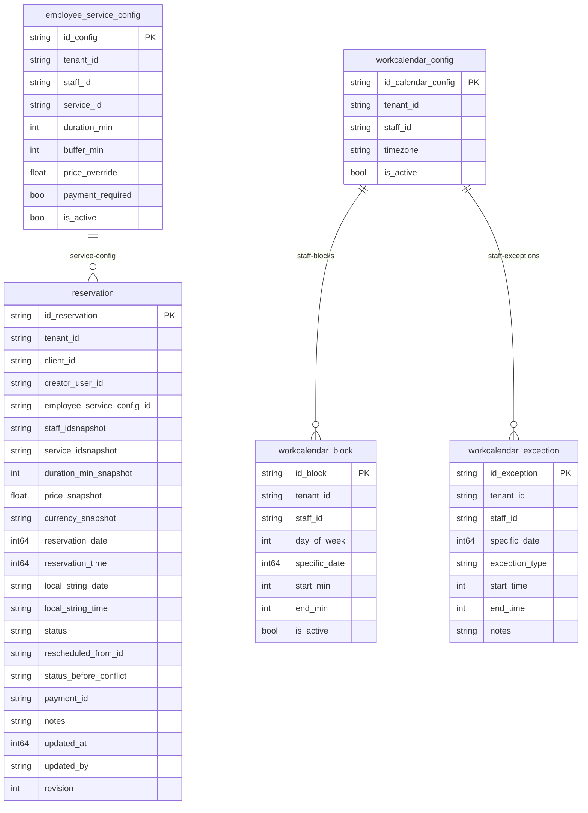

# Database Diagram — appointment-booking

> **Soft references (no physical FK):**
> - `reservation.client_id` → Directory/Clinical module
> - `reservation.creator_user_id` → IAM module
> - `employee_service_config.service_id` → Catalog module
> - `staff_id` fields → Staff module
> - `reservation.payment_id` → Payment module (nullable)
>
> **`workcalendar_config`** is the single source of truth for the IANA timezone of a staff member's calendar.
> `workcalendar_block` and `workcalendar_exception` do NOT carry timezone — they inherit it from `workcalendar_config`.
>
> **`workcalendar_block`** holds BOTH shapes in one table: `specific_date == 0` is a WEEKLY block
> (applies to `day_of_week`, `is_active` toggles it), `specific_date > 0` is a DATED block (applies
> to that date only and opens it even when the weekly template has nothing for that weekday). A day
> with several blocks ("morning + afternoon") is several rows; the lunch break is the GAP between
> them — there is no break column. `start_min`/`end_min` are minutes from midnight in the staff's
> local timezone.
>
> **`reservation.status`** is enforced by an in-code FSM (not a DB table). `CONFLICTED` is a
> non-terminal state whose `status_before_conflict` records where the reservation came from, so a
> recomputation can restore it exactly.
>
> **Irregular column names — do not "fix":** `staff_idsnapshot` / `service_idsnapshot` lack the
> underscore between `id` and `snapshot` (a historical snake_case quirk already live in production);
> a rename would force a destructive column rename in every deployed database.
>
> Availability rules (blocks + exceptions + the establishment's `time.DayBounds` window) are enforced
> at the service layer, not via DB relations.