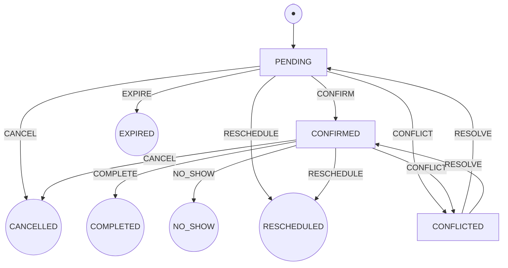

# FSM Diagram — appointment-booking

Finite State Machine for `Reservation.Status`. All transitions are enforced by `fsm.go`.
Terminal states (double circle) have no outgoing transitions.

`CONFLICTED → (PENDING | CONFIRMED)` via `RESOLVE` is shown as both successors on purpose: the
actual restore target is whatever `StatusBeforeConflict` recorded — the resolution is a recomputation
that re-evaluates the appointment against the CURRENT schedule, never a guess between the two.

## State descriptions

| State | Meaning | Terminal |
|---|---|---|
| `PENDING` | Created, awaiting confirmation or payment | No |
| `CONFIRMED` | Confirmed (optionally with payment linked) | No |
| `CANCELLED` | Cancelled voluntarily by staff or client | Yes |
| `COMPLETED` | Appointment was held successfully | Yes |
| `NO_SHOW` | Client did not attend | Yes |
| `EXPIRED` | Unpaid PENDING reservation that timed out — triggered externally by `expire_pending_reservations` MCP tool | Yes |
| `RESCHEDULED` | Original reservation superseded by a new one — distinct from CANCELLED for audit/analytics | Yes |
| `CONFLICTED` | The current schedule (professional's blocks or the establishment's window) no longer covers this appointment — marked/cleared by a recomputation, never by a user event | **No** |

## Event descriptions

| Event | Valid from | Notes |
|---|---|---|
| `CONFIRM` | `PENDING` | Optionally sets `payment_id` |
| `CANCEL` | `PENDING`, `CONFIRMED` | Voluntary cancellation |
| `COMPLETE` | `CONFIRMED` | Appointment attended |
| `NO_SHOW` | `CONFIRMED` | Client did not appear |
| `EXPIRE` | `PENDING` | Called by external scheduler only |
| `RESCHEDULE` | `PENDING`, `CONFIRMED` | Original marked RESCHEDULED; new reservation created atomically |
| `CONFLICT` | `PENDING`, `CONFIRMED` | Fired only by a conflict recomputation, never by a user event |
| `RESOLVE` | `CONFLICTED` | Restores `StatusBeforeConflict` after a recomputation confirms the appointment fits again |
